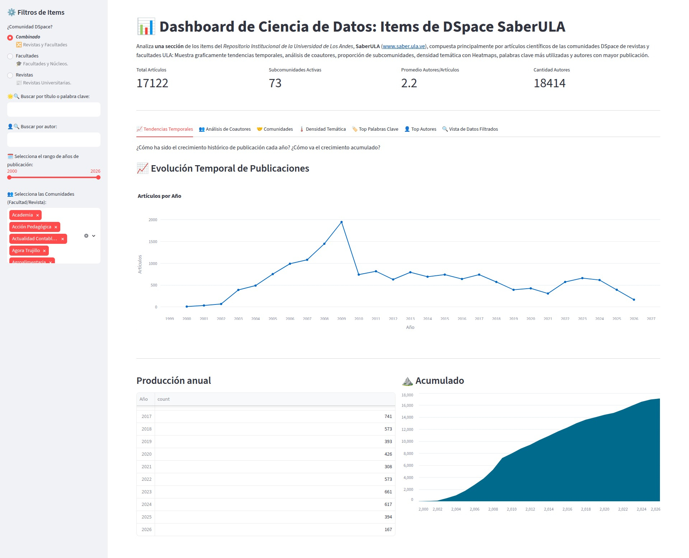
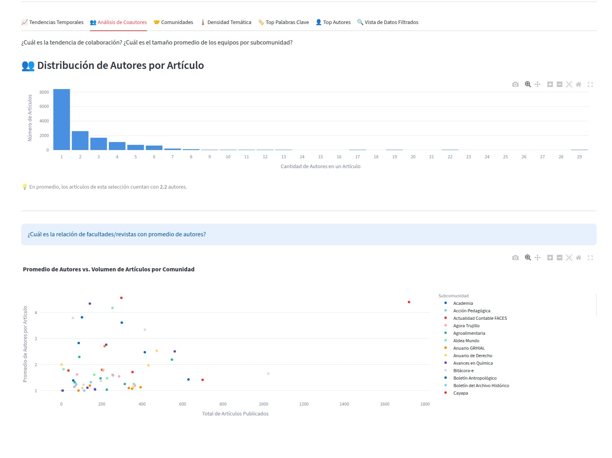
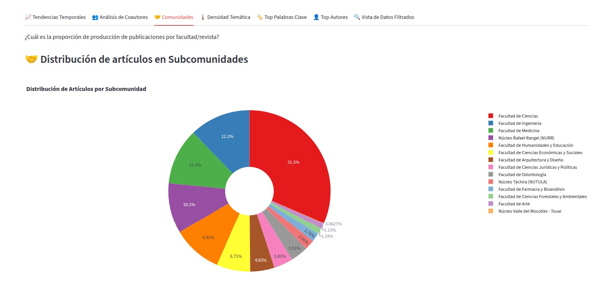
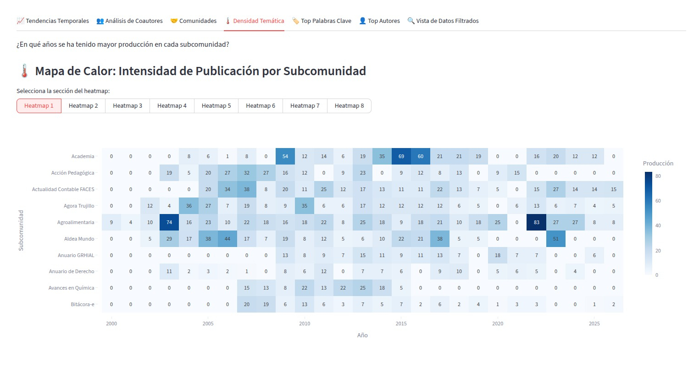
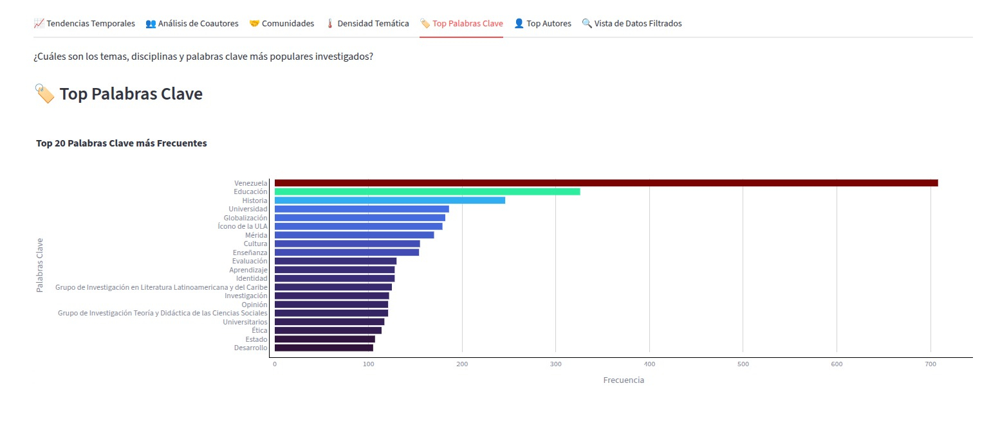
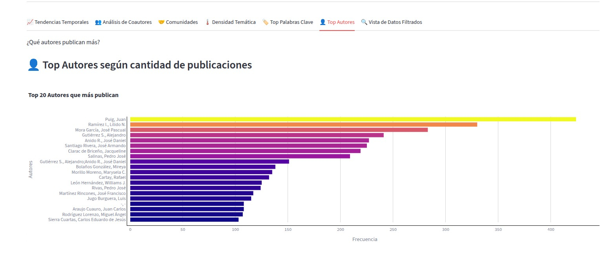
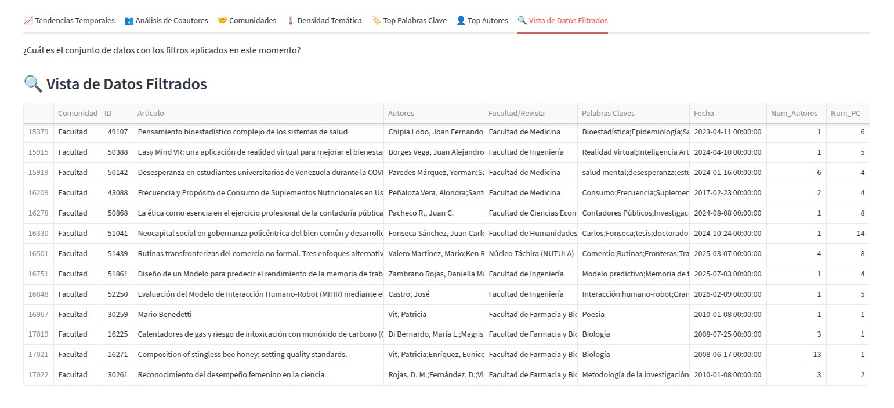

# 📊 Análisis de datos: Repositorio Institucional Universitario

## 🎯 Resumen del Proyecto
Desarrollo de un pipeline de datos (ETL) y dashboard interactivo en Python (Streamlit) diseñado para automatizar la transformación de datos crudos de un repositorio universitario. 
El sistema convierte registros académicos en métricas institucionales clave, facilitando a la institución el análisis de su producción científica.

---

## 🛠️ Stack Tecnológico

* **Lenguaje**: Python 3.x
* **Pipeline & ETL**: Pandas, Github Actions, Crontab
* **Visualización**: Plotly (Dashboard interactivo)
* **Framework Web**: Streamlit
* **Gestión de Datos**: CSV, SQL, formatos optimizados de almacenamiento (Parquet)

---

## ⚙️ Arquitectura y Flujo de Datos ETL (Extract, Transform, Load) (Data Pipeline)

Este proyecto simula un entorno de Ingeniería de Datos real en 3 fases:

* **🗄️ Extracción (CSV [obtenido de SQL]):** Los datos se extraen de un archivo CSV. Este archivo proviene de una consulta optimizada de la base de datos del repositorio DSpace ( **[script SQL](./sql/consultas_articulos_dspace.sql)** ).

* **🧹 Transformación**: Procesamiento de datos con Pandas para limpieza, imputación de nulos, eliminación de registros con fechas anómalas y estandarización, generando un registro de logs para auditoría.

* **💾 Carga**: Exportación a formato `Parquet` (altamente optimizado), que posteriormente alimentará la aplicación. El proceso está totalmente automatizado mediante `GitHub Actions` y `Crontab` para mantener el dashboard actualizado.

---

## 📈 Capacidades Analíticas (Dashboard)

El dashboard implementado en Streamlit incluye:

* 📅 **Tendencia temporal de publicación:** Análisis de picos de actividad científica mediante gráficos de evolución anual.
* 👥 **Análisis de coautores:** Tendencias de colaboración en los trabajos de investigación. Correlación de 'promedios de autores por articulos' y subcomunidades (y con 'total de artículos por subcomunidad').
* 🤝 **Comunidades:** Producción por subcomunidades: Facultades y Revistas.
* 🗺️ **Heatmap subcomunidades:** Mapa de calor de producción histórica para identificar tendencias de producción histórica y períodos de inactividad. Con paginado cuando los filtros generan más de 10 subcomunidades.
* 🔑 **Palabras clave:** Análisis de términos recurrentes y tendencias temáticas.
* 👤 **Top autores:** Ranking de los investigadores con mayor volumen de publicaciones.
* 🔍 **Vista de datos filtrados:** Una tabla dinamica que muestra los registros analizados con los filtros aplicados.

---   
   
## 💻 Instalación y Ejecución Local

Sigue estos pasos para configurar el entorno de desarrollo en tu máquina local:

1. **Clona este repositorio:**
   ```bash
   git clone git@github.com:Diego-Uzc-J/Analisis-de-datos-Repositorio-Institucional.git
   cd Analisis-de-datos-Repositorio-Institucional
   ```

2. **Crea y activa un entorno virtual (Recomendado):**
   * **En Linux/macOS:**
     ```bash
     python3 -m venv venv
     source venv/bin/activate
     ```
   * **En Windows (Command Prompt / PowerShell):**
     ```bash
     python -m venv venv
     .\venv\Scripts\activate
     ```

3. **Instala las dependencias del proyecto:**
   ```bash
   pip install --upgrade pip
   pip install -r requirements.txt
   ```

4. **Ejecuta la aplicación de Streamlit:**
   ```bash
   streamlit run app.py
   ```


## 📂 Estructura del Proyecto

```text
├── capturas/
│   └── 0*_Dashboard-*.jpg    # Imágenes para documentación en README.md
├── data/
│   ├── articulos_comms_fac_y_rev.csv # Muestra de datos obtenida de aplicar el SQL sobre la base de datos del repositorio DSpace
│   └── articulos_procesados.parquet  # Muestra de datos obtenidos del ETL y utilizados por la aplicación
├── logs/
│   └── etl_pipeline.log    # Registro de ejecución del ETL
├── sql/
│   └── consultas_articulos_dspace.sql    # Consulta SQL optimizada para extraer los datos del repositorio DSpace
├── src/
│   ├── etl.py              # Funciones para el Pipeline ETL (Exatacción, Transformación y Carga)
│   └── plots.py            # Funciones para generar las gráficas (Plotly)
├── tests/
│   └── test_etl.sql    # Consulta SQL optimizada para extraer los datos del repositorio DSpace
├── .gitignore              # Archivos ignorados por Git (entornos virtuales, caché)
├── README.md               # Documentación principal del proyecto
├── app.py                  # Archivo principal de Streamlit (punto de entrada)
└── requirements.txt        # Bibliotecas de Python necesarias para el despliegue
```

---

## 📸 Vista Previa del Dashboard

A continuación se muestran algunas de las visualizaciones interactivas incluidas en la plataforma:
<br/>
<table>
  <tr>
    <td>
        <b>Filtros generales, PKIs y gráficos de tendencia temporal</b>
        
    </td>
    <td>
        <b>Análisis de Coautorías y Correlación con Subcomunidades</b>
        
    </td>
  </tr>
  <tr>
    <td>
        <b>Distribución subcomunidades</b>
        
    </td>
    <td>
        <b>Heatmap subcomunidades (facultades y/o revistas)</b>
        
    </td>
  </tr>  
  <tr>
    <td>
        <b>Top Palabras Clave</b>
        
    </td>
    <td>
        <b>Top Autores</b>
        
    </td>
  </tr>
  <tr>
    <td colspan="2">
        <b>Dataset</b>
        
    </td>
  </tr>
</table>

---

## 📝 Ejemplo Logs Pipeline ETL

```text
2026-07-18 11:21:01,372 [INFO] ---------------------------------------
2026-07-18 11:21:01,373 [INFO] | Iniciando Ejecución del Pipeline ETL
2026-07-18 11:21:01,374 [INFO] ---------------------------------------
2026-07-18 11:21:01,374 [INFO] Cargando datos desde archivo de origen: data/articulos_comms_fac_y_rev.csv...
2026-07-18 11:21:01,514 [INFO] Extracción exitosa. Registros iniciales: 17131
2026-07-18 11:21:01,515 [INFO] Iniciando fase de transformación y limpieza...
2026-07-18 11:21:01,518 [WARNING] Se detectaron 9 filas con fechas inválidas. Índices: [183, 8956, 8957, 9082, 9083, 10183, 10184, 11475, 11476]
2026-07-18 11:21:01,536 [INFO] Transformación completada. Registros actuales: 17122
2026-07-18 11:21:01,537 [INFO] Guardando archivo Parquet en: data/articulos_procesados.parquet...
2026-07-18 11:21:01,591 [INFO] ¡Carga exitosa! Archivo Parquet creado de manera limpia.
2026-07-18 11:21:01,592 [INFO] ---------------------------------------
2026-07-18 11:21:01,592 [INFO] | Pipeline Completado con Éxito
2026-07-18 11:21:01,593 [INFO] ---------------------------------------
```


---
*Creado por Ing. Diego A. Uzcátegui J. | www.linkedin.com/in/diego-uzc-j | Portafolio Profesional*


